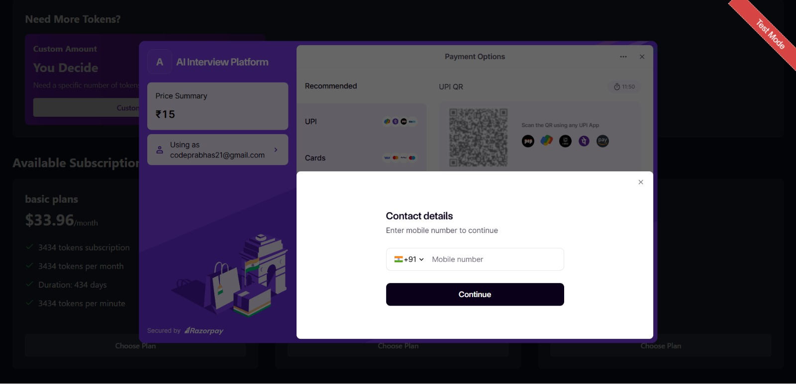

---

# AHRS – AI Automated Hiring & Recruitment System

## Team Name and Members

**Team:** CodeCrackers
**Members:**

* Sharan Medamoni
* Sai Maneeshwar 
* Nithya B
* manogna 

---

## Problem Statement Reference

Traditional hiring processes are slow, costly, and often biased:

* **Time-consuming** – Average of 42 days to hire, impacting productivity.
* **High costs** – \$4,700 average per hire; executive hires can exceed \$14,000.
* **Biased evaluations** – 60% of candidates report unfair treatment.
* **Limited scalability** – Manual processes cannot efficiently handle high-volume recruitment.

---

## Overview of the Solution

**AHRS** is an **AI-powered recruitment platform** that streamlines the entire hiring lifecycle.
It leverages artificial intelligence to:

* Generate **role-specific interview questions** dynamically.
* Perform **real-time candidate evaluation**.
* Monitor **non-verbal cues** like eye movement and head position.
* Deliver **instant feedback** to recruiters.

The result: **35% faster hiring**, **bias elimination**, and a **scalable recruitment process** that adapts to any hiring volume.

---

## Features

* **Dynamic Question Generation** – AI-tailored based on job description and candidate profile.
* **Real-Time Evaluation** – Instant scoring on accuracy, depth, and confidence.
* **Non-Verbal Monitoring** – Eye movement, head position, and engagement tracking.
* **Customizable Difficulty** – Adjust challenge levels based on seniority and complexity.
* **Scalable Architecture** – AWS Lambda and DynamoDB ensure enterprise-grade scalability.
* **Token-Based Pricing** – Pay-per-use model for cost efficiency.

---

## Tech Stack

* **Frontend:** React
* **Backend:** AWS Lambda (Serverless Functions)
* **Database:** AWS DynamoDB (NoSQL)
* **Storage:** AWS S3
* **AI/ML:** Custom NLP & Computer Vision models for evaluation and behavioral analysis
* **APIs:** JobBoard API, ResumeHub API, TalentLink API
* **Security:** End-to-end encryption, role-based access control, GDPR & SOC 2 compliance

---

## Installation & Setup

1. **Clone the repository**

   ```bash
   git clone https://github.com/MedamoniSharan/Ahrs_hack.git
   cd Ahrs_hack
   ```

2. **Install dependencies**

   ```bash
   npm install
   ```

3. **Setup environment variables**

   * Create a `.env` file in the root directory.
   * Add your AWS credentials, API keys, and database config.

4. **Run the development server**

   ```bash
   npm run dev
   ```

5. **Build for production**

   ```bash
   npm run build
   ```

---

## Usage Guide

### For Recruiters

1. Create job postings with required skill sets.
2. Launch interviews with AI-generated dynamic questions.
3. View real-time scoring and candidate analytics.

### For Candidates

1. Join the interview via the provided link.
2. Answer dynamic questions on camera.
3. Get evaluated instantly with feedback sent to recruiters.

---





## Demo Links

* **Video Demo:** *\[Add link here]*
* **Live Deployment:** *https://ahrslive.netlify.app/*

---

## License

This project is licensed under the **MIT License** – see the [LICENSE](LICENSE) file for details.

---
